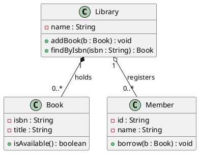

# Lab 03 · W03 — UML Essentials Practice

> **ISAD · Fall 2026** · Lab block (90 minutes) · Week 03, Sep 14 – Sep 20
> **Milestone**: **none this week** — deliberately. No tag to push, nothing graded.
> **Slides**: `W03-UML-Essentials-and-Modeling-Workflow.pptx`, pages 26–37

**Purpose of this lab.** Make the pipeline boring. Week 04 lands the requirements pack and M1 starts running; this is the last week where you can break the toolchain without a deadline watching. By the end you will have rendered a PlantUML file, drawn the same idea in draw.io, and pushed both — with a team convention everyone signed.

---

## 0. Before You Start (~5 min)

- [ ] M0 was submitted: `git ls-remote --tags origin` lists `refs/tags/m0`. *(If not — stop and tell the instructor now. This is the last easy week to fix it.)*
- [ ] draw.io opens on your machine.
- [ ] VS Code is installed. **The PlantUML extension is optional** — the web renderer at <https://www.plantuml.com/plantuml> works fine and shows syntax errors inline.
- [ ] Your team repo is cloned on your laptop **and you can push** (not just the Lead — everyone).

> **Course default, stated once:** *model in PlantUML, present in draw.io.* Both source files go in the repository. **A PNG on its own is not a submission.**

---

## 1. What the Lecture Gave You

| From the lecture | The one line you need |
|---|---|
| Two families, fourteen diagrams | Structure vs behaviour. You will use six of them. |
| Which diagram answers which question | Choosing the wrong diagram is the most common modelling error. |
| A model is *true enough*, not true | You are not documenting reality; you are serving a purpose. |
| `.puml` diffs in two lines, `.drawio` in 340 | Text diagrams are version-controllable. That is why the default is PlantUML. |

**The sentence to remember:** *a PNG with no source file is worth zero — the source is the deliverable, the image is only its shadow.*

---

## 2. Demo — Instructor-Led (~10 min)

The instructor renders the Library model (slide 28) live and reads the syntax out loud. **Watch how a line of text becomes a line on paper.**



**Three things to take away:**

- [ ] `class Name { ... }` — everything between the braces is the class box: name, then attributes, then operations, **in that order**.
- [ ] **Read an association left to right**: multiplicity → line style → multiplicity → `:` → association name.
- [ ] `*--` is composition (parts die with the whole), `o--` is aggregation, bare `--` is a plain association.

**Your notes:**

```
What - and + mean in front of an attribute:  ______________________________

The difference between *-- and o--, in my own words:
  ______________________________________________

Why "0..*" and not "1..*" on the Book end:
  ______________________________________________
```

---

## 3. Task A — Exercise 3.1: Name That Diagram (~15 min)

**Goal.** Learn to pick a diagram by the **question** it answers, not by what it looks like.

**Input.** Six fragments on slide 32. Ten minutes alone, then the pair next to you reads your answers.

### Steps

1. For **each** fragment, write two things — and the second one is the one that earns the mark:

   | # | Which diagram is it? | **The question this diagram answers** |
   |---|---|---|
   | A | | |
   | B | | |
   | C | | |
   | D | | |
   | E | | |
   | F | | |

2. **"It is a class diagram" earns half a mark.** The full answer is *"it is a class diagram, and it answers 'what concepts exist and how are they connected?'"*
3. Swap papers with your neighbour and read theirs out loud. If your two answers disagree, argue — then bring the disagreement to the group.

> **D and E are the ones people mix up.** Pay attention to *when* things happen versus *what state* something is in.

**Done when**

- [ ] Six rows, each with a diagram name **and** a question.
- [ ] No two rows give the same question. If they do, you have named two diagrams the same way.
- [ ] You can say each row out loud in one sentence.

### Stuck?

| Symptom | Fix |
|---|---|
| Two fragments look identical | Look for **time**. If messages flow between lifelines, it is interaction. If one object moves between states, it is behaviour. |
| Confusing state and activity | A **state** diagram waits for events (one object). An **activity** diagram shows flow and forks (a process). |
| Cannot phrase the question | Start with the interrogative: *what concepts…* / *what does the system do…* / *in what order…* / *what states…* |

---

## 4. Task B — Prove the Toolchain on Your Machine (~15 min)

**Goal.** Both tools demonstrably work **on your laptop**, not on the Lead's. This is checklist item 1 and 2 on slide 36.

**Input.** Your laptop, draw.io, either the VS Code PlantUML extension or the web renderer.

### Steps

1. **draw.io** — draw one class box, save as `probe.drawio`, export as `probe.png`.

   ```
   Verify:   ls -la probe.drawio probe.png
   ```

   Both files must exist. Then delete them — this was a probe, not a deliverable.

2. **PlantUML** — paste the slide 28 snippet (§2 above) into `probe.puml` and render it.
   - VS Code: install *PlantUML* extension, open the file, press `Alt` + `D`.
   - Web: paste into <https://www.plantuml.com/plantuml> — it renders and shows syntax errors inline.
   - Command line (only if you have Java): `java -jar plantuml.jar probe.puml`

3. Confirm you see **three class boxes and two associations**. If you see a syntax error page, you have a typo — read the error, it names the line.

**Done when**

- [ ] A `.drawio` file and its `.png` export both appeared on disk.
- [ ] A `.puml` file rendered into a picture with three boxes.
- [ ] You know which of the two rendering paths **you personally** will use this term.

### Stuck?

| Symptom | Fix |
|---|---|
| `Syntax Error?` in the rendered image | 90% of the time: a missing `@enduml`, or a class name with a space in it. |
| `java: command not found` | No Java runtime. Use the **VS Code extension or the web renderer** — the command line is optional in this course. |
| Extension renders nothing | Check the file ends in `.puml`. Save first, then `Alt`+`D`. |
| Rendered image is blank white | The file is empty or the diagram is inside a comment. A line starting with `'` is a comment. |
| Web renderer is slow / blocked | Local rendering is not required for grading. Screenshot the web render and commit the `.puml` — the **source** is what is graded. |

---

## 5. Task C — Exercise 3.2: The Library Model (~25 min)

**Goal.** Write a real model in text, defend every number in it, and commit **source + image**.

**Input.** The skeleton below (slide 34). **Two lines are left blank for you.**

### Steps

1. **Pair on one keyboard.** One person types (driver), the other argues about multiplicities (navigator). Swap at 12 minutes.
2. Create `docs/diagrams/library.puml` and start from this:

   ```plantuml
   @startuml
   class Library {
     - name : String
     + addBook(b : Book) : void
   }

   class Book {
     - isbn : String
     + isAvailable() : boolean
   }

   class Member {
     - name : String
     + borrow(b : Book) : void
   }

   ' TODO 1  Library holds Books -- a
   '         composition. One library,
   '         many books. Fill the ???
   Library "1" *-- "???" Book : holds

   ' TODO 2  A Member may hold zero or more
   '         Books. A plain link, no diamond.
   Member "???" -- "???" Book : borrows
   @enduml
   ```

3. **Fill the four `???`.** Do not guess — defend each number out loud before you type it.
4. **A comment is allowed, and worth marks.** If your pair disagreed, record it with a line starting with `'`:

   ```plantuml
   ' DISAGREEMENT: we could not settle whether a Member must exist for a Book to be
   ' borrowed. Chose 0..1 so a Book can sit on a shelf unborrowed.
   ```

5. **Render before you submit.** A `.puml` file that does not render is not a model.
6. **Export the PNG** and commit both files beside each other:

   ```bash
   git add docs/diagrams/library.puml docs/diagrams/library.png
   git commit -m "W03: library domain model — composition vs plain association, see comment"
   git push
   ```

**Self-check** — before you commit, answer these three:

- [ ] Can a **Library with no books** exist in my model? (If not, you wrote `1..*` and forced a fake `Book` into every new branch. That error reaches production.)
- [ ] Can a **Book sit unborrowed** on a shelf? (If you wrote `1` at the Member end, no book can ever be on a shelf.)
- [ ] Is the diamond **filled** where the parts die with the whole, and absent where they do not?

> *A different answer can be correct. It stops being correct the moment you cannot say why.* Answers are discussed in class from slide 35 — do not scroll ahead.

### Stuck?

| Symptom | Fix |
|---|---|
| `*--` and `o--` look the same when rendered | Zoom in. Filled diamond = composition. If still unsure, add a comment saying which you intended — then check at the review. |
| Multiplicity rejected as syntax | Multiplicities are **strings**: `"0..*"`, not `0..*`. |
| Colon association name breaks the render | Format is exactly `A "1" -- "0..*" B : label` — space before and after the colon. |
| Want to add a method | Fine — but this is a **design** class diagram then. Analysis models have no operations. Know which one you are drawing. |

---

## 6. Task D — Agree the Six Conventions & Set Up the Folder (~15 min)

**Goal.** Stop re-arguing file names for the rest of the term. This is checklist items 3–5 on slide 36.

**Input.** Slide 30. As a team, agree these six **today**, write them into the README, and do not discuss them again.

| Convention | Agree on | Write it down |
|---|---|---|
| **Naming** | Lower-case kebab, one artefact per file: `domain-model.puml`, `order-sequence.puml`, `order-state.puml`. No `final`, no `v3`. | ☐ |
| **Location** | Everything under `docs/diagrams/` in the team repo. Never on a laptop, never as a chat attachment. | ☐ |
| **Colour** | One palette only: white = agreed concept, blue = proposed this week, grey = deprecated. Nothing else. | ☐ |
| **Decision line** | Every diagram gets one sentence in the README next to it: *the decision the diagram is making.* | ☐ |
| **Export** | The PNG is exported from the source and committed beside it, same name, different extension. | ☐ |
| **Ownership** | The README names an owner per file. Editing someone else's file needs a commit message that says why. | ☐ |

### Steps

1. **Create the folder** if Lab 02 did not already:

   ```bash
   mkdir -p docs/diagrams
   touch docs/diagrams/.gitkeep
   git add docs/diagrams/.gitkeep && git commit -m "W03: create diagrams folder" && git push
   ```

   > The path must be right **before** M1, not during it.

2. **Add the six conventions** to `README.md` under a `## Diagram conventions` heading. Copy them from slide 30 and make them yours.
3. **Every member pushes one commit.** Not the Lead — *everyone*. If only one person has commits, the other two are invisible in the contribution review (Individual grade B2, 15%).

   ```bash
   git add README.md && git commit -m "W03: agree six diagram conventions" && git push
   ```

4. **Add one decision line** under `docs/diagrams/README.md` for the library model, e.g.:

   > `library.puml` — *books belong to a library (composition) but are only loosely held by members (plain association), so a book can exist unborrowed.* Owner: `<name>`

**Done when**

- [ ] `docs/diagrams/` exists in the repo with `library.puml` + `library.png` inside.
- [ ] The six conventions are committed in `README.md`.
- [ ] **Every** member has at least one commit this week (`git log --author=<your-email>`).
- [ ] Your `library.puml` has a decision line and a named owner.

### Stuck?

| Symptom | Fix |
|---|---|
| `git log` shows only the Lead's commits | You are pushing from the Lead's laptop. Clone the repo yourself and commit from your own account. |
| Two members used different tools | The **convention** matters more than the tool: any `.drawio` or `.puml` source is accepted. But pick one per diagram type so diffs stay readable. |
| Cannot agree on naming | Take slide 30 verbatim. Arguing for ten more minutes has no upside. |
| Team folder still not created | Commit an empty `.gitkeep` now. An empty folder is not tracked by Git — a file inside it is. |

---

## 7. Before You Leave (~5 min)

**The five-point checklist from slide 36** — this is the whole point of Week 3:

- [ ] **draw.io can open, edit and export** — proven: one class box saved as `.drawio`, exported as PNG, both on disk.
- [ ] **PlantUML renders on your machine** — proven: the Exercise 3.2 file produces a picture. Extension or web renderer, either is fine.
- [ ] **`docs/diagrams/` exists in the team repo** — with a `.gitkeep` if it is still empty.
- [ ] **The conventions document is committed** — naming, colour, decision line, export rule, ownership table.
- [ ] **Every member has pushed one commit** — not the Lead. Everyone.

> **M1 lands on Sun Oct 4.** It asks for a use-case diagram and two written specifications. The toolchain you finish today is the one you will submit with — there is no second chance to set it up later.
>
> **Nothing is submitted until the tag is pushed.** Not this week (no milestone), but from Week 4 onwards this sentence is the difference between a mark and a zero.

---

## 8. Homework (before Week 4)

1. **PLANTUML — reproduce two diagrams from their text specs.** The specs are on the course site under Week 03: a four-class CampusBites domain model and a sequence diagram. Type them out, render them, commit both `.puml` files.
   > These two files count towards your **individual contribution**. Commit them from your own account, in your own words — even if the pair shared a keyboard in the lab.
2. **READING — Fowler, *UML Distilled*, class and sequence chapters.** A skim is enough. Come back with **one thing you disagree with**, or one thing that changed your mind.
   > Why this is not filler: Fowler writes in short, opinionated chapters and tells you which 20% of UML is worth your time — exactly the argument this lecture made.
3. **PROJECT — create the team diagrams folder and commit the conventions**, if the team did not finish Task D in the lab.

> Stuck on syntax? <https://www.plantuml.com/plantuml> renders any snippet in the browser and shows the error inline. Use it — do not fight the extension.
>
> **Next week the requirements pack lands**, and the use case stops being a picture and becomes a specification.

---

## 9. Reference

| Document | What it answers |
|---|---|
| `../CampusBites-项目指导书-Project-Guidebook.md` | §6 Submission rules · directory layout · file formats · language policy |
| `../CampusBites-Deadline-Schedule-and-Submission-Guide.md` | §4.3 tag protocol (`m1` next, due Sun Oct 4) · §4.5 GitHub-unreachable fallback |
| `../CampusBites-Lab-Guide-实验指导书.md` | The 16-week lab plan at a glance |
| `../../00-课程文件/Course-Syllabus-课程标准.md` | Full syllabus and weekly schedule |
| `Lab-02-W02-Team-Formation-and-M0-Kickoff.md` | Repo creation, `klausren` invitation, tag protocol |

**Rendering:** VS Code PlantUML extension (`Alt`+`D`) · web renderer <https://www.plantuml.com/plantuml> · draw.io <https://app.diagrams.net>

*Lab questions go to the instructor in class, or open an issue in the course repository.*

---

*Lab 03 · v1.0 · Information Systems Analysis and Design · Fall 2026*
